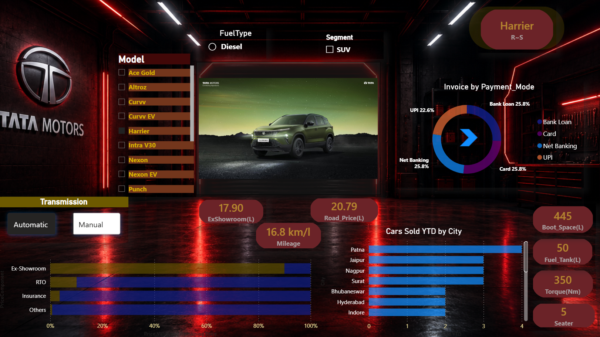
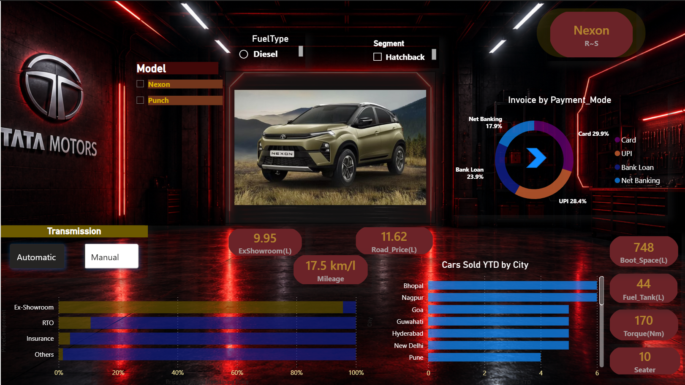
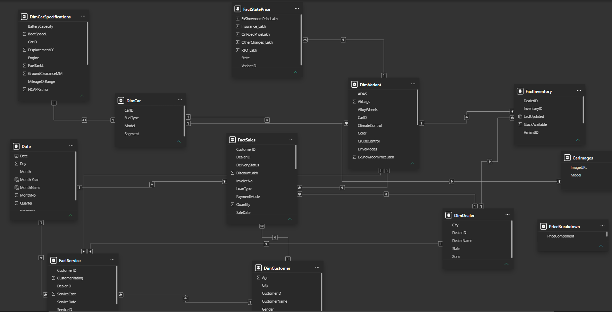

# 🚗 Tata Motors Sales Analytics Dashboard


---

## 📌 Project Overview

This project is an interactive Power BI dashboard built using Tata Motors vehicle data.

The dashboard enables users to explore individual Tata vehicle models through dynamic filters, KPIs, pricing analysis, technical specifications, customer insights, payment analysis, and inventory information.

The dashboard follows a premium dark automotive-inspired UI with dynamic vehicle images and interactive storytelling.

---

# 📷 Dashboard Preview

## Executive Dashboard



---

## Car Overview



---

## Data Model



---

# 🚀 Features

- Dynamic Vehicle Image Rendering
- Vehicle-wise Analysis
- Premium KPI Cards
- Price Breakdown Analysis
- Vehicle Specifications
- Interactive Filters
- Dynamic Slicers
- Customer Analysis
- Dealer Analysis
- Inventory Analysis
- Payment Mode Analysis
- Dark Neon UI Design

---

# 📊 Dashboard Insights

The dashboard answers business questions such as:

- Which Tata vehicle has the highest On-Road Price?
- How is the final vehicle price distributed between Ex-Showroom, Insurance, RTO and Other Charges?
- Which payment method is preferred?
- Which cities generate more vehicle sales?
- What are the technical specifications of each vehicle?
- Compare Petrol, Diesel and Electric variants.
- Analyze inventory availability.

---

# 🛠 Tech Stack

- Power BI
- DAX
- Power Query
- Excel
- Data Modeling
- GitHub

---

# 🗂 Data Model

Star Schema

- FactSales
- FactInventory
- FactService
- FactStatePrice

Dimension Tables

- DimCar
- DimVariant
- DimDealer
- DimCustomer
- DimCarSpecifications
- Date

---

# 📁 Project Structure

```
Tata-Motors-Sales-Analytics-Dashboard
│
├── Tata_Motors_Sales_Analytics_Dashboard.pbix
├── Tata_Motors_Dataset.xlsx
├── Dashboard_Demo.mp4
├── Executive_Overview.png
├── Car_Overview.png
├── Data_Model.png
└── README.md
```

---

# 📈 Skills Demonstrated

✔ Data Cleaning

✔ Data Modeling

✔ DAX

✔ Power Query

✔ Dashboard Design

✔ Business Intelligence

✔ Data Visualization

✔ Storytelling

---

# 🎯 Future Improvements

- Power BI Service Deployment
- Mobile Layout
- AI Insights
- Forecasting
- RLS (Row-Level Security)

---

# 👨‍💻 Author

**Rishabh Singh**

Aspiring Data Analyst

Power BI Developer

